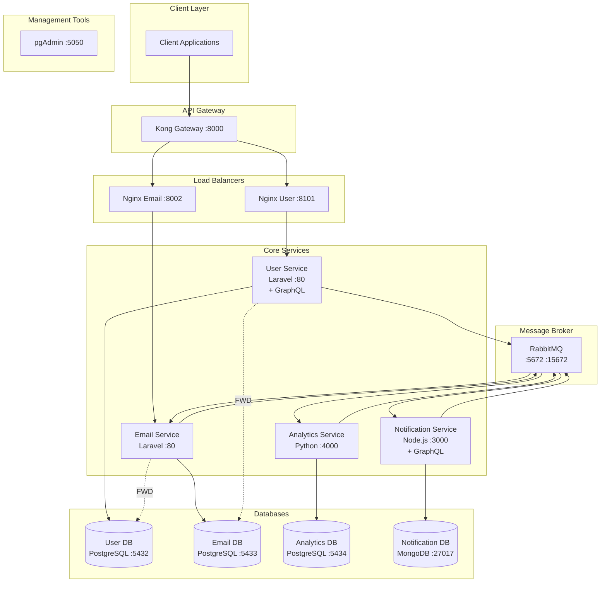
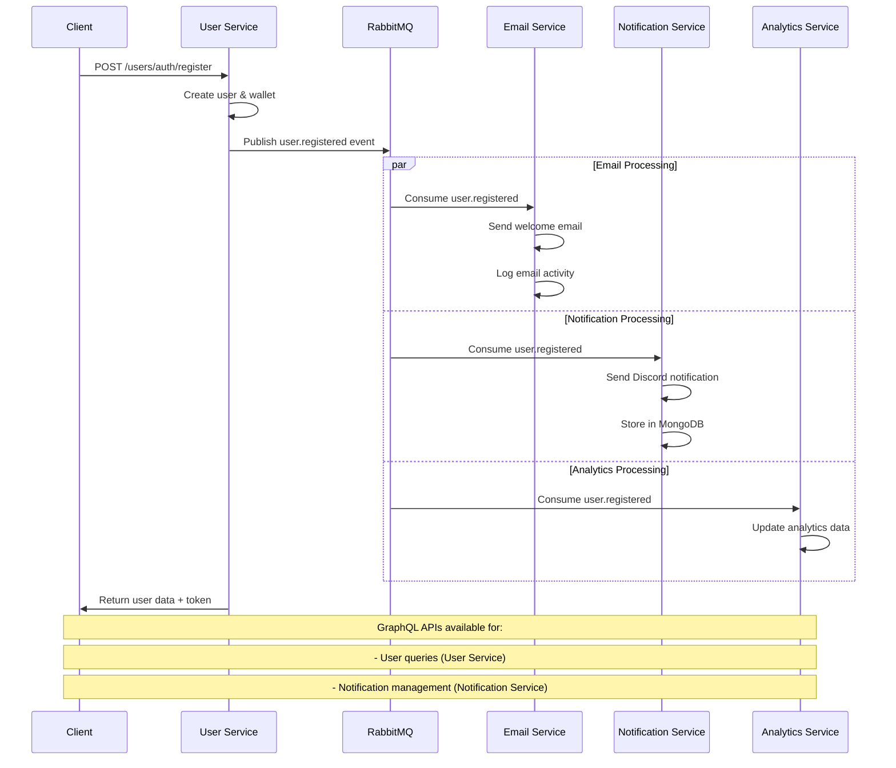

# 🚀 Microservices Architecture Learning Project

<div align="center">


**A comprehensive microservices ecosystem demonstrating inter-service communication, event-driven architecture, and multi-technology stack integration**

[](https://laravel.com)
[](https://nodejs.org)
[](https://python.org)
[](https://postgresql.org)
[](https://mongodb.com)
[](https://rabbitmq.com)
[](https://konghq.com)
[](https://graphql.org)

</div>

---

## 📋 Table of Contents

- [🎯 Project Overview](#-project-overview)
- [🏗️ Architecture](#️-architecture)
- [🛠️ Technology Stack](#️-technology-stack)
- [📦 Services](#-services)
- [🚀 Quick Start](#-quick-start)
- [🔧 Configuration](#-configuration)
- [📊 API Endpoints](#-api-endpoints)
- [🔍 GraphQL APIs](#-graphql-apis)
- [🔄 Event Flow](#-event-flow)
- [📈 Monitoring & Management](#-monitoring--management)
- [🧪 Learning Objectives](#-learning-objectives)
- [📚 Project Structure](#-project-structure)
- [🤝 Contributing](#-contributing)

---

## 🎯 Project Overview

This project is a **comprehensive microservices learning platform** that demonstrates modern distributed system patterns using multiple technology stacks. It showcases event-driven architecture, inter-service communication, containerization best practices, and modern API design with both REST and GraphQL endpoints.

### ✨ Key Features

- 🔄 **Event-Driven Architecture** with RabbitMQ message broker
- 🏢 **Multi-Service Architecture** with separate databases
- 🐳 **Full Docker Containerization** with Docker Compose
- 🌐 **API Gateway** with Kong for routing and management
- 📧 **Email Notifications** with Laravel queue system
- 🔔 **Discord Notifications** with Node.js service
- 📊 **Analytics Service** with Python/FastAPI
- 🔗 **Foreign Data Wrappers** for cross-service data access
- ⚖️ **Load Balancing** with Nginx
- 🗄️ **Database Management** with pgAdmin
- 🔍 **GraphQL APIs** for flexible data querying
- 📱 **Real-time Notifications** with MongoDB persistence

---

## 🏗️ Architecture



---

## 🛠️ Technology Stack

### Backend Services
| Service | Technology | Framework | Database | API | Purpose |
|---------|------------|-----------|----------|-----|---------|
| **User Service** | PHP 8.2 | Laravel 10 | PostgreSQL | REST + GraphQL | User management, authentication, wallet operations |
| **Email Service** | PHP 8.2 | Laravel 10 | PostgreSQL | REST | Email notifications, queue processing |
| **Notification Service** | Node.js 18+ | Express.js | MongoDB | REST + GraphQL | Discord notifications, real-time alerts |
| **Analytics Service** | Python 3.11+ | FastAPI | PostgreSQL | REST | Data analytics, reporting, metrics |

### Infrastructure
| Component | Technology | Purpose |
|-----------|------------|---------|
| **Containerization** | Docker + Docker Compose | Service orchestration |
| **Message Broker** | RabbitMQ 3.12 | Inter-service communication |
| **API Gateway** | Kong 3.4 | Request routing, load balancing |
| **Web Server** | Nginx | Load balancing, static file serving |
| **Databases** | PostgreSQL 15 + MongoDB 4.4 | Data persistence |
| **Management** | pgAdmin | Database administration |

---

## 📦 Services

### 🔐 User Service (Laravel)
**Port:** `8101` | **Database:** `user_service` | **API:** REST + GraphQL

Core authentication and user management service with wallet functionality and GraphQL API.

**Features:**
- User registration and authentication
- JWT token-based auth with Laravel Sanctum
- Wallet deposit operations
- Foreign Data Wrapper integration
- RabbitMQ event publishing
- **GraphQL API** with comprehensive user queries

**REST Endpoints:**
- `POST /users/auth/register` - User registration
- `POST /users/auth/login` - User login
- `POST /users/wallet/deposit` - Wallet deposit (authenticated)

**GraphQL Endpoint:**
- `POST /graphql` - GraphQL API endpoint

### 📧 Email Service (Laravel)
**Port:** `8002` | **Database:** `email_service` | **API:** REST

Handles all email-related operations with background queue processing.

**Features:**
- Welcome email templates
- Wallet deposit notifications
- RabbitMQ consumer for background processing
- Email logging and tracking
- Foreign Data Wrapper for user data access

**Key Components:**
- `ConsumeUserEvents` - Background queue consumer
- `WelcomeEmail` - User registration emails
- `WalletDepositEmail` - Transaction notifications

### 🔔 Notification Service (Node.js)
**Port:** `3000` | **Database:** `notification_service` | **API:** REST + GraphQL

Real-time Discord notifications for system events with comprehensive GraphQL API.

**Features:**
- Discord webhook integration
- RabbitMQ consumer for real-time events
- Structured logging with Winston
- Event-driven notification system
- **MongoDB persistence** for notification history
- **GraphQL API** for notification management

**Key Components:**
- `RabbitMQConsumer` - Message processing
- `DiscordService` - Discord API integration
- `NotificationService` - Business logic
- **GraphQL Schema** - Comprehensive notification queries and mutations

### 📊 Analytics Service (Python)
**Port:** `4000` | **Database:** `analytics_service` | **API:** REST

Data analytics and reporting service with FastAPI.

**Features:**
- User registration analytics
- Event tracking and metrics
- RESTful API with FastAPI
- RabbitMQ consumer for data ingestion
- PostgreSQL integration with SQLAlchemy

**Key Components:**
- `analytics_routes.py` - API endpoints
- `analytics_service.py` - Business logic
- `rabbitmq_consumer.py` - Event processing

---

## 🚀 Quick Start

### Prerequisites
- Docker & Docker Compose
- Git

### 1. Clone the Repository
```bash
git clone https://github.com/yourusername/microservices-laravel-django-nodejs.git
cd microservices-laravel-django-nodejs
```

### 2. Start All Services
```bash
docker-compose up -d
```

### 3. Wait for Services to Initialize
```bash
# Check service status
docker-compose ps

# View logs
docker-compose logs -f
```

### 4. Access Services

| Service | URL | Credentials |
|---------|-----|-------------|
| **Kong Gateway** | http://localhost:8000 | - |
| **User Service** | http://localhost:8101 | - |
| **User GraphQL** | http://localhost:8101/graphql | - |
| **Email Service** | http://localhost:8002 | - |
| **Notification Service** | http://localhost:3000 | - |
| **Notification GraphQL** | http://localhost:3000/graphql | - |
| **Analytics Service** | http://localhost:4000 | - |
| **RabbitMQ Management** | http://localhost:15672 | admin/password |
| **pgAdmin** | http://localhost:5050 | admin@admin.com/admin |

---

## 🔧 Configuration

### Environment Variables

Each service uses environment variables for configuration:

```bash
# Database Configuration
DB_HOST=service-db
DB_DATABASE=service_name
DB_USERNAME=postgres
DB_PASSWORD=password

# MongoDB Configuration (Notification Service)
MONGODB_URI=mongodb://mongodb:27017/notification_service

# RabbitMQ Configuration
RABBITMQ_HOST=rabbitmq
RABBITMQ_PORT=5672
RABBITMQ_USERNAME=admin
RABBITMQ_PASSWORD=password

# Discord Configuration (Notification Service)
DISCORD_WEBHOOK_URL=your_webhook_url
DISCORD_BOT_TOKEN=your_bot_token
DISCORD_GUILD_ID=your_guild_id
DISCORD_CHANNEL_ID=your_channel_id
```

### RabbitMQ Queues

The system uses the following queues for event processing:

- `email.user.registered` - User registration emails
- `email.user.wallet.deposit` - Wallet deposit notifications
- `notification.user.registered` - Discord notifications
- `analytics.user.registered` - Analytics data collection

---

## 📊 API Endpoints

### User Service API

#### REST Endpoints

```http
# Authentication
POST /users/auth/register
Content-Type: application/json
{
  "name": "John Doe",
  "email": "john@example.com",
  "password": "password123"
}

POST /users/auth/login
Content-Type: application/json
{
  "email": "john@example.com",
  "password": "password123"
}

# Wallet Operations (Authenticated)
POST /users/wallet/deposit
Authorization: Bearer <token>
Content-Type: application/json
{
  "amount": 100.00,
  "description": "Initial deposit"
}
```

#### GraphQL Endpoints

```graphql
# User Service GraphQL - http://localhost:8101/graphql

# Query Users
query GetUsers {
  users {
    id
    name
    email
    balance
    wallet {
      id
      balance
      created_at
    }
    transactions(limit: 10) {
      id
      amount_float
      type
      confirmed
      created_at
    }
  }
}

# Query Users with Filters
query GetUserByEmail($email: String!) {
  users(email: $email) {
    id
    name
    email
    balance
  }
}

# Query User with Transaction Filter
query GetUserTransactions($id: Int!, $confirmed: Boolean) {
  users(id: $id) {
    id
    name
    email
    transactions(confirmed: $confirmed, limit: 5) {
      id
      amount_float
      type
      confirmed
      created_at
    }
  }
}
```

### Notification Service API

#### REST Endpoints

```http
# Health Check
GET /health

# Test Discord Connection
GET /test-discord
```

#### GraphQL Endpoints

```graphql
# Notification Service GraphQL - http://localhost:3000/graphql

# Query Notifications
query GetNotifications($filter: NotificationFilter, $page: Int, $limit: Int) {
  notifications(filter: $filter, page: $page, limit: $limit) {
    notifications {
      id
      userId
      userName
      userEmail
      type
      title
      message
      status
      priority
      isRead
      createdAt
      channels {
        name
        status
        sentAt
      }
    }
    totalCount
    pageInfo {
      hasNextPage
      hasPreviousPage
      currentPage
      totalPages
    }
  }
}

# Query Notifications by User
query GetUserNotifications($userId: String!, $page: Int, $limit: Int) {
  notificationsByUser(userId: $userId, page: $page, limit: $limit) {
    notifications {
      id
      title
      message
      type
      status
      isRead
      createdAt
    }
    totalCount
  }
}

# Query Unread Notifications
query GetUnreadNotifications($userId: String, $page: Int, $limit: Int) {
  unreadNotifications(userId: $userId, page: $page, limit: $limit) {
    notifications {
      id
      title
      message
      type
      priority
      createdAt
    }
    totalCount
  }
}

# Query Notification Statistics
query GetNotificationStats($userId: String, $startDate: DateTime, $endDate: DateTime) {
  notificationStats(userId: $userId, startDate: $startDate, endDate: $endDate) {
    total
    sent
    failed
    pending
    unread
    byType {
      type
      count
    }
    byStatus {
      status
      count
    }
    byPriority {
      priority
      count
    }
    recentNotifications {
      id
      title
      type
      status
      createdAt
    }
  }
}

# Create Notification
mutation CreateNotification($input: CreateNotificationInput!) {
  createNotification(input: $input) {
    id
    userId
    userName
    userEmail
    type
    title
    message
    status
    priority
    createdAt
  }
}

# Mark Notification as Read
mutation MarkAsRead($id: ID!) {
  markAsRead(id: $id) {
    id
    isRead
    readAt
  }
}

# Mark All Notifications as Read
mutation MarkAllAsRead($userId: String!) {
  markAllAsRead(userId: $userId)
}
```

### Analytics Service API

```http
# Analytics Endpoints
GET /analytics/users/registered
GET /analytics/events
GET /analytics/health
```

---

## 🔍 GraphQL APIs

### User Service GraphQL Features

The User Service provides a comprehensive GraphQL API built with Laravel GraphQL (Rebing/GraphQL-Laravel):

#### **Types Available:**
- **User** - Complete user information with wallet and transaction data
- **Wallet** - User wallet details with balance information
- **Transaction** - Wallet transaction history with filtering options

#### **Key Features:**
- 🔍 **Flexible Querying** - Query only the data you need
- 🔗 **Nested Relations** - Access wallet and transaction data in single queries
- 🎯 **Advanced Filtering** - Filter users by ID, name, or email
- 💰 **Wallet Integration** - Direct access to balance and transaction history
- ⚡ **Performance Optimized** - Efficient database queries with proper indexing

#### **Example Queries:**

```graphql
# Get user with wallet and recent transactions
query {
  users(email: "john@example.com") {
    id
    name
    email
    balance
    wallet {
      id
      balance
      created_at
    }
    transactions(limit: 5, confirmed: true) {
      id
      amount_float
      type
      confirmed
      created_at
    }
  }
}
```

### Notification Service GraphQL Features

The Notification Service provides a powerful GraphQL API built with Apollo Server 4:

#### **Types Available:**
- **Notification** - Complete notification information
- **NotificationStats** - Comprehensive statistics and analytics
- **PaginatedNotifications** - Paginated notification lists
- **Channel** - Notification delivery channel information

#### **Key Features:**
- 📊 **Advanced Analytics** - Comprehensive notification statistics
- 🔍 **Powerful Filtering** - Filter by user, type, status, priority, date range
- 📄 **Pagination** - Efficient pagination for large datasets
- 🔍 **Full-Text Search** - Search across titles, messages, and user information
- 📈 **Real-time Stats** - Live notification metrics and trends
- 🎯 **Flexible Mutations** - Create, update, and manage notifications

#### **Example Queries:**

```graphql
# Get notification statistics
query {
  notificationStats {
    total
    sent
    failed
    unread
    byType {
      type
      count
    }
    recentNotifications {
      id
      title
      type
      createdAt
    }
  }
}

# Search notifications
query {
  searchNotifications(query: "registration", page: 1, limit: 10) {
    notifications {
      id
      title
      message
      type
      status
      createdAt
    }
    totalCount
  }
}
```

---

## 🔄 Event Flow



---

## 📈 Monitoring & Management

### Health Checks
- **User Service:** `GET /users/health`
- **Notification Service:** `GET /health`
- **Analytics Service:** `GET /analytics/health`
- **RabbitMQ:** Management UI at `:15672`

### GraphQL Playgrounds
- **User Service GraphQL:** http://localhost:8101/graphql
- **Notification Service GraphQL:** http://localhost:3000/graphql

### Logging
- All services include structured logging
- Logs are available via `docker-compose logs <service>`
- Persistent log volumes for analytics and notifications

### Database Management
- **pgAdmin** available at `:5050` (PostgreSQL)
- **MongoDB** accessible via Docker container
- Connect to all database instances
- Credentials: `admin@admin.com` / `admin`

---

## 🧪 Learning Objectives

This project demonstrates:

### 🏗️ **Architecture Patterns**
- Microservices architecture
- Event-driven design
- CQRS (Command Query Responsibility Segregation)
- Database per service pattern
- **GraphQL API design patterns**

### 🔄 **Communication Patterns**
- Asynchronous messaging with RabbitMQ
- Event sourcing concepts
- Foreign Data Wrappers for data access
- API Gateway pattern
- **REST vs GraphQL API design**

### 🛠️ **Technology Integration**
- Multi-language service development
- Container orchestration
- Service discovery and load balancing
- Database management and migrations
- **GraphQL implementation across different stacks**

### 📊 **Operational Excellence**
- Health monitoring
- Structured logging
- Configuration management
- Development vs production environments
- **API documentation and testing**

### �� **Modern API Design**
- **GraphQL schema design**
- **Query optimization**
- **Real-time data fetching**
- **API versioning strategies**

---

## 📚 Project Structure

```
microservices-laravel-django-nodejs/
├── 📁 user-service/           # Laravel user management
│   ├── app/Http/Controllers/  # API controllers
│   ├── app/Models/           # Eloquent models
│   ├── app/Listeners/        # FWD listeners
│   ├── app/GraphQL/          # GraphQL implementation
│   │   ├── Type/            # GraphQL types (User, Wallet, Transaction)
│   │   └── Query/           # GraphQL queries
│   └── routes/api.php        # API routes
├── 📁 email-service/         # Laravel email processing
│   ├── app/Console/Commands/ # Queue consumers
│   ├── app/Mail/            # Email templates
│   └── resources/views/     # Blade templates
├── 📁 notification-service/  # Node.js Discord service
│   ├── src/services/        # Business logic
│   ├── src/graphql/         # GraphQL schema & resolvers
│   ├── src/models/          # MongoDB models
│   └── server.js           # Express server
├── 📁 analytics-service/    # Python analytics
│   ├── app/api/            # FastAPI routes
│   ├── app/models/         # SQLAlchemy models
│   └── app/services/       # Analytics logic
├── 📁 rabbitmq/            # Message broker config
├── 📁 nginx/               # Load balancer configs
├── 📁 kong/                # API gateway setup
└── 📄 docker-compose.yml   # Service orchestration
```

---

## 🤝 Contributing

This is a learning project! Feel free to:

- 🐛 Report issues or bugs
- 💡 Suggest improvements
- 📖 Add documentation
- 🔧 Submit pull requests
- ⭐ Star the repository

### Development Setup

1. Fork the repository
2. Create a feature branch
3. Make your changes
4. Test with `docker-compose up`
5. Test GraphQL endpoints
6. Submit a pull request

---

<div align="center">

**Built with ❤️ for learning microservices architecture**


*This project showcases modern microservices patterns using multiple technology stacks, including comprehensive GraphQL APIs, and serves as a comprehensive learning resource for distributed systems development.*

</div>
