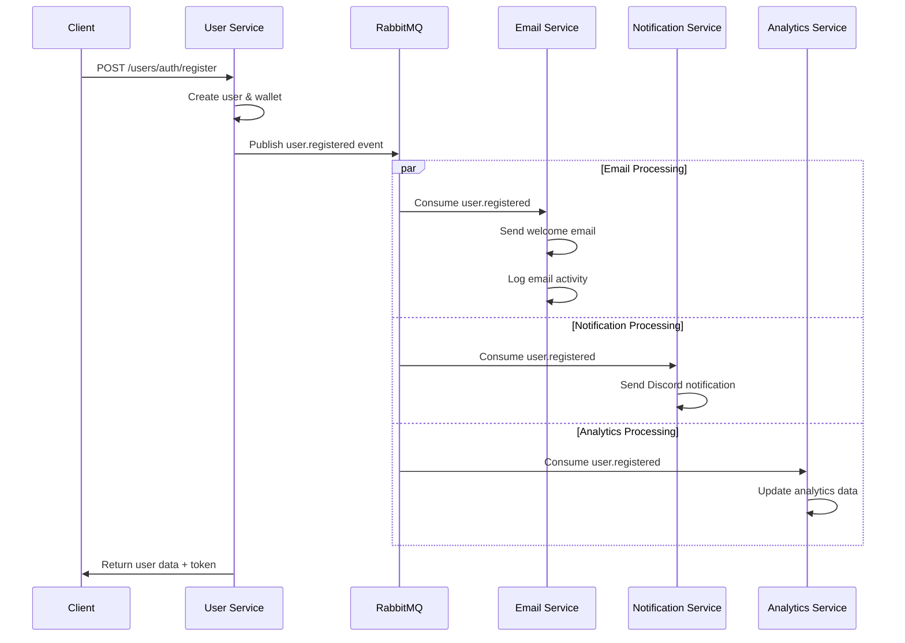

# 🚀 Microservices Architecture Learning Project

<div align="center">


**A comprehensive microservices ecosystem demonstrating inter-service communication, event-driven architecture, and multi-technology stack integration**

[](https://laravel.com)
[](https://nodejs.org)
[](https://python.org)
[](https://postgresql.org)
[](https://rabbitmq.com)
[](https://konghq.com)

</div>

---

## 📋 Table of Contents

- [🎯 Project Overview](#-project-overview)
- [🏗️ Architecture](#️-architecture)
- [🛠️ Technology Stack](#️-technology-stack)
- [📦 Services](#-services)
- [🚀 Quick Start](#-quick-start)
- [🔧 Configuration](#-configuration)
- [📊 API Endpoints](#-api-endpoints)
- [🔄 Event Flow](#-event-flow)
- [📈 Monitoring & Management](#-monitoring--management)
- [🧪 Learning Objectives](#-learning-objectives)
- [📚 Project Structure](#-project-structure)
- [🤝 Contributing](#-contributing)

---

## 🎯 Project Overview

This project is a **comprehensive microservices learning platform** that demonstrates modern distributed system patterns using multiple technology stacks. It showcases event-driven architecture, inter-service communication, and containerization best practices.

### ✨ Key Features

- 🔄 **Event-Driven Architecture** with RabbitMQ message broker
- 🏢 **Multi-Service Architecture** with separate databases
- 🐳 **Full Docker Containerization** with Docker Compose
- 🌐 **API Gateway** with Kong for routing and management
- 📧 **Email Notifications** with Laravel queue system
- 🔔 **Discord Notifications** with Node.js service
- 📊 **Analytics Service** with Python/FastAPI
- �� **Foreign Data Wrappers** for cross-service data access
- ⚖️ **Load Balancing** with Nginx
- 🗄️ **Database Management** with pgAdmin

---

## 🏗️ Architecture

```mermaid
graph TB
    subgraph "Client Layer"
        C[Client Applications]
    end
    
    subgraph "API Gateway"
        K[Kong Gateway :8000]
    end
    
    subgraph "Load Balancers"
        N1[Nginx User :8101]
    end
    
    subgraph "Core Services"
        US[User Service<br/>Laravel :80]
        ES[Email Service<br/>Laravel (worker)]
        NS[Notification Service<br/>Node.js :3000]
        AS[Analytics Service<br/>Python :4000]
    end
    
    subgraph "Message Broker"
        RMQ[RabbitMQ<br/>:5672 :15672]
    end
    
    subgraph "Databases"
        UDB[(User DB<br/>PostgreSQL :5432)]
        EDB[(Email DB<br/>PostgreSQL :5433)]
        ADB[(Analytics DB<br/>PostgreSQL :5434)]
    end
    
    subgraph "Management Tools"
        PG[pgAdmin :5050]
    end
    
    C --> K
    K --> N1
    N1 --> US
    
    US --> RMQ
    ES --> RMQ
    NS --> RMQ
    AS --> RMQ
    
    US --> UDB
    ES --> EDB
    AS --> ADB
    
    US -.->|FWD| EDB
    ES -.->|FWD| UDB
    
    RMQ --> NS
    RMQ --> AS
    RMQ --> ES
```

---

## 🛠️ Technology Stack

### Backend Services
| Service | Technology | Framework | Database | Purpose |
|---------|------------|-----------|----------|---------|
| **User Service** | PHP 8.2 | Laravel 10 | PostgreSQL | User management, authentication, wallet operations |
| **Email Service** | PHP 8.2 | Laravel 10 | PostgreSQL | Email notifications, queue processing |
| **Notification Service** | Node.js 18+ | Express.js | - | Discord notifications, real-time alerts |
| **Analytics Service** | Python 3.11+ | FastAPI | PostgreSQL | Data analytics, reporting, metrics |

### Infrastructure
| Component | Technology | Purpose |
|-----------|------------|---------|
| **Containerization** | Docker + Docker Compose | Service orchestration |
| **Message Broker** | RabbitMQ 3.12 | Inter-service communication |
| **API Gateway** | Kong 3.4 | Request routing, load balancing |
| **Web Server** | Nginx | Load balancing, static file serving |
| **Database** | PostgreSQL 15 | Data persistence |
| **Management** | pgAdmin | Database administration |

---

## 📦 Services

### 🔐 User Service (Laravel)
**Port:** `8101` | **Database:** `user_service`

Core authentication and user management service with wallet functionality.

**Features:**
- User registration and authentication
- JWT token-based auth with Laravel Sanctum
- Wallet deposit operations
- Foreign Data Wrapper integration
- RabbitMQ event publishing

**Key Endpoints:**
- `POST /users/auth/register` - User registration
- `POST /users/auth/login` - User login
- `POST /users/wallet/deposit` - Wallet deposit (authenticated)

### 📧 Email Service (Laravel)
Internal worker that consumes RabbitMQ messages to send emails and log activity. No client-facing API.

**Features:**
- Welcome email templates
- Wallet deposit notifications
- RabbitMQ consumer for background processing
- Email logging and tracking
- Foreign Data Wrapper for user data access

**Key Components:**
- `ConsumeUserEvents` - Background queue consumer
- `WelcomeEmail` - User registration emails
- `WalletDepositEmail` - Transaction notifications

### �� Notification Service (Node.js)
**Port:** `3000`

Real-time Discord notifications for system events.

**Features:**
- Discord webhook integration
- RabbitMQ consumer for real-time events
- Structured logging with Winston
- Event-driven notification system

**Key Components:**
- `RabbitMQConsumer` - Message processing
- `DiscordService` - Discord API integration
- `NotificationService` - Business logic

### 📊 Analytics Service (Python)
**Port:** `4000` | **Database:** `analytics_service`

Data analytics and reporting service with FastAPI.

**Features:**
- User registration analytics
- Event tracking and metrics
- RESTful API with FastAPI
- RabbitMQ consumer for data ingestion
- PostgreSQL integration with SQLAlchemy

**Key Components:**
- `analytics_routes.py` - API endpoints
- `analytics_service.py` - Business logic
- `rabbitmq_consumer.py` - Event processing

---

## 🚀 Quick Start

### Prerequisites
- Docker & Docker Compose
- Git

### 1. Clone the Repository
```bash
git clone https://github.com/yourusername/microservices-laravel-django-nodejs.git
cd microservices-laravel-django-nodejs
```

### 2. Start All Services
```bash
docker-compose up -d
```

### 3. Wait for Services to Initialize
```bash
# Check service status
docker-compose ps

# View logs
docker-compose logs -f
```

### 4. Access Services

| Service | URL | Credentials |
|---------|-----|-------------|
| **Kong Gateway** | http://localhost:8000 | - |
| **User Service** | http://localhost:8101 | - |
| **Notification Service** | http://localhost:3000 | - |
| **Analytics Service** | http://localhost:4000 | - |
| **RabbitMQ Management** | http://localhost:15672 | admin/password |
| **pgAdmin** | http://localhost:5050 | admin@admin.com/admin |

---

## 🔧 Configuration

### Environment Variables

Each service uses environment variables for configuration:

```bash
# Database Configuration
DB_HOST=service-db
DB_DATABASE=service_name
DB_USERNAME=postgres
DB_PASSWORD=password

# RabbitMQ Configuration
RABBITMQ_HOST=rabbitmq
RABBITMQ_PORT=5672
RABBITMQ_USERNAME=admin
RABBITMQ_PASSWORD=password
```

### RabbitMQ Queues

The system uses the following queues for event processing:

- `email.user.registered` - User registration emails
- `email.user.wallet.deposit` - Wallet deposit notifications
- `notification.user.registered` - Discord notifications
- `analytics.user.registered` - Analytics data collection

---

## 📊 API Endpoints

### User Service API

```http
# Authentication
POST /users/auth/register
Content-Type: application/json
{
  "name": "John Doe",
  "email": "john@example.com",
  "password": "password123"
}

POST /users/auth/login
Content-Type: application/json
{
  "email": "john@example.com",
  "password": "password123"
}

# Wallet Operations (Authenticated)
POST /users/wallet/deposit
Authorization: Bearer <token>
Content-Type: application/json
{
  "amount": 100.00,
  "description": "Initial deposit"
}
```

### Analytics Service API

```http
# Analytics Endpoints
GET /analytics/users/registered
GET /analytics/events
GET /analytics/health
```

---

## 🔄 Event Flow



---

## 📈 Monitoring & Management

### Health Checks
- **User Service:** `GET /users/health`
- **Analytics Service:** `GET /analytics/health`
- **RabbitMQ:** Management UI at `:15672`

### Logging
- All services include structured logging
- Logs are available via `docker-compose logs <service>`
- Persistent log volumes for analytics and notifications

### Database Management
- **pgAdmin** available at `:5050`
- Connect to all PostgreSQL instances
- Credentials: `admin@admin.com` / `admin`

---

## 🧪 Learning Objectives

This project demonstrates:

### 🏗️ **Architecture Patterns**
- Microservices architecture
- Event-driven design
- CQRS (Command Query Responsibility Segregation)
- Database per service pattern

### 🔄 **Communication Patterns**
- Asynchronous messaging with RabbitMQ
- Event sourcing concepts
- Foreign Data Wrappers for data access
- API Gateway pattern

### 🛠️ **Technology Integration**
- Multi-language service development
- Container orchestration
- Service discovery and load balancing
- Database management and migrations

### 📊 **Operational Excellence**
- Health monitoring
- Structured logging
- Configuration management
- Development vs production environments

---

## 📚 Project Structure

```
microservices-laravel-django-nodejs/
├── 📁 user-service/           # Laravel user management
│   ├── app/Http/Controllers/  # API controllers
│   ├── app/Models/           # Eloquent models
│   ├── app/Listeners/        # FWD listeners
│   └── routes/api.php        # API routes
├── 📁 email-service/         # Laravel email processing
│   ├── app/Console/Commands/ # Queue consumers
│   ├── app/Mail/            # Email templates
│   └── resources/views/     # Blade templates
├── 📁 notification-service/  # Node.js Discord service
│   ├── src/services/        # Business logic
│   └── server.js           # Express server
├── 📁 analytics-service/    # Python analytics
│   ├── app/api/            # FastAPI routes
│   ├── app/models/         # SQLAlchemy models
│   └── app/services/       # Analytics logic
├── 📁 rabbitmq/            # Message broker config
├── 📁 nginx/               # Load balancer configs
├── 📁 kong/                # API gateway setup
└── 📄 docker-compose.yml   # Service orchestration
```

---

## 🤝 Contributing

This is a learning project! Feel free to:

- 🐛 Report issues or bugs
- 💡 Suggest improvements
- 📖 Add documentation
- 🔧 Submit pull requests
- ⭐ Star the repository

### Development Setup

1. Fork the repository
2. Create a feature branch
3. Make your changes
4. Test with `docker-compose up`
5. Submit a pull request

---

<div align="center">

**Built with ❤️ for learning microservices architecture**


*This project showcases modern microservices patterns using multiple technology stacks and serves as a comprehensive learning resource for distributed systems development.*

</div>
